# Ejercicios de Mapeo del modelo E-R a Relacional

## Ejercicio 1

### Modelo E-R

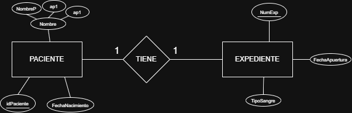

### Modelo Relacional

## Ejercicio 2

### Modelo E-R

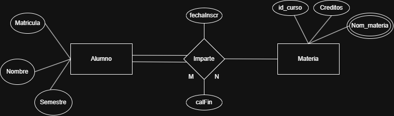

### Modelo Relacional
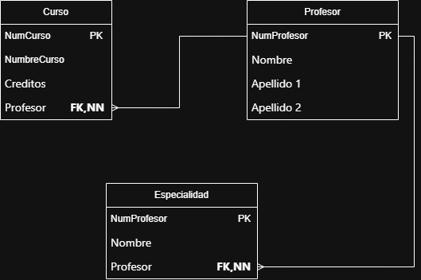

## Ejercicio 3

### Modelo E-R

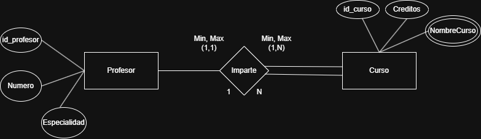

### Modelo Relacional
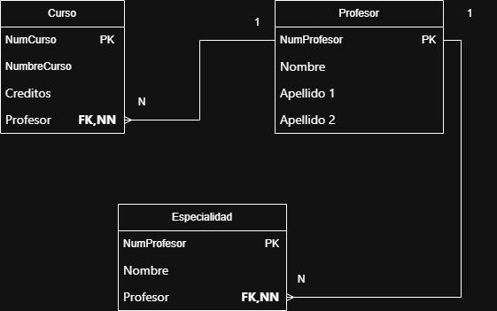

## Ejercicio 4

### Modelo E-R

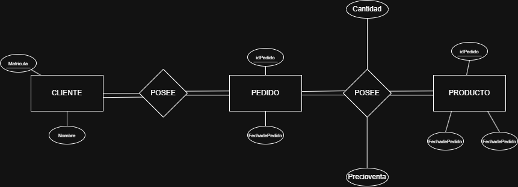

### Modelo Relacional
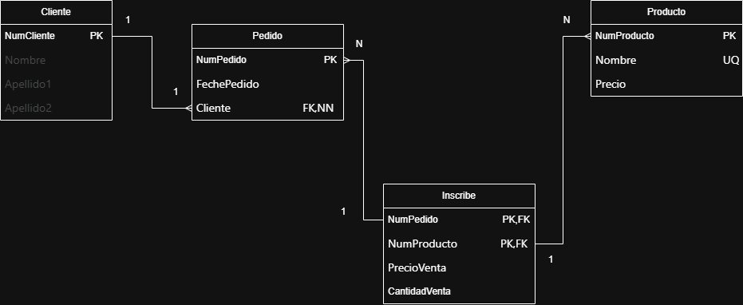

## Ejercicio 5

### Modelo E-R

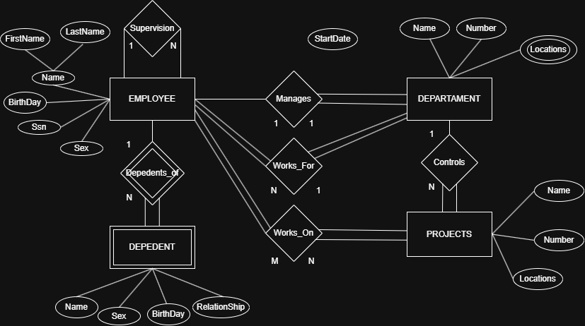

### Modelo Relacional

### Version 1
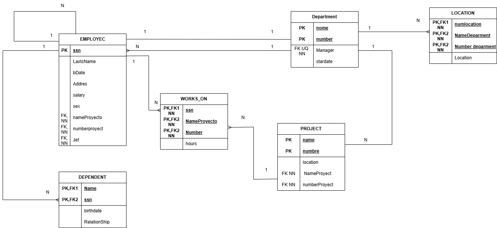

### Version 2
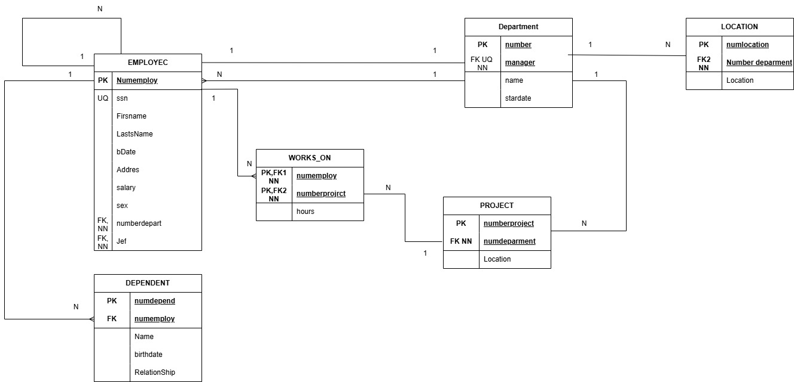

## Ejercicio 6

### Modelo E-R

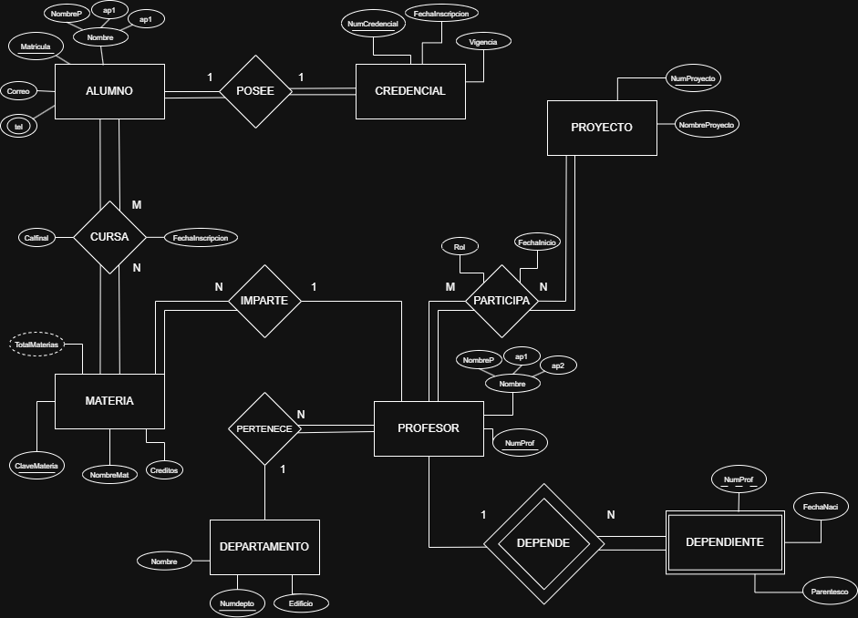

### Modelo Relacional
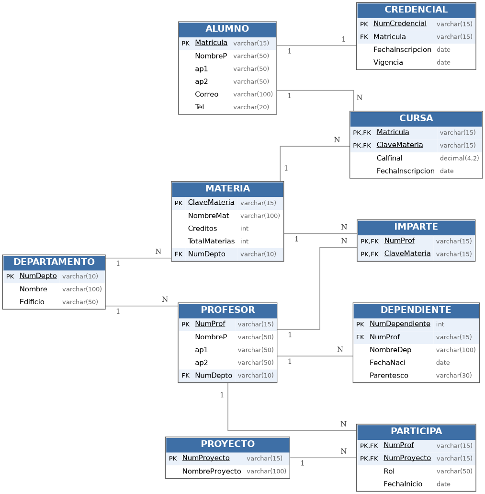
