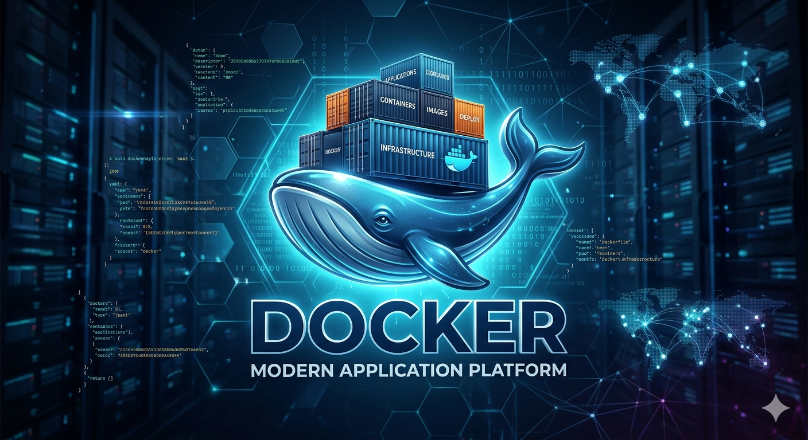

# Documentacion de contenedores Docker de Sistemas Gestores de Base de Datos

## Contenedor de Tutorial de Docker
docker pull docker/getting-started

docker run -d -p 80:80 docker/getting started

- -d detach (El proceso del contenedor se ejecuta en background) 
- -p (port, publish) (Mapea el puerto)
- docker/getting-started (Nombre de la imagen)

## Contenedor del DBMS MariaDB
docker pull mariadb

## Comandos Docker
| Comando | Descripcion |
| :--- | :--- |
| dockerpull nombre_imagen | **Descargar una imagen de DockerHub**  |
| docker images | **Visializar las imagenes que se encuentran en el docker** |